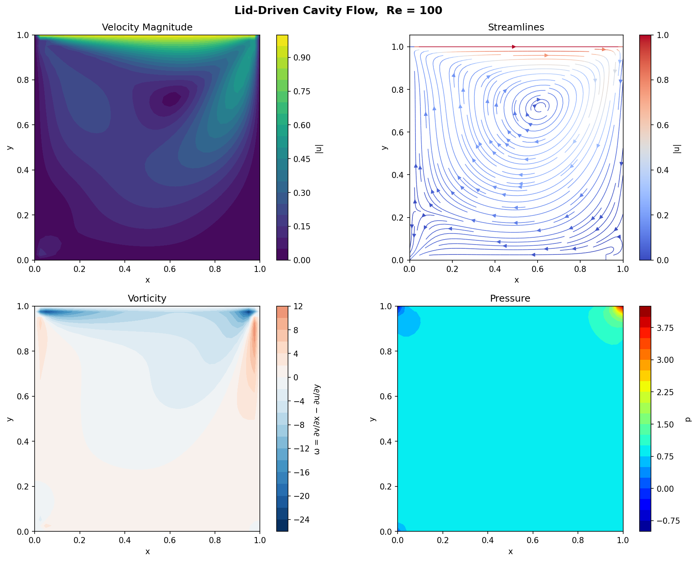
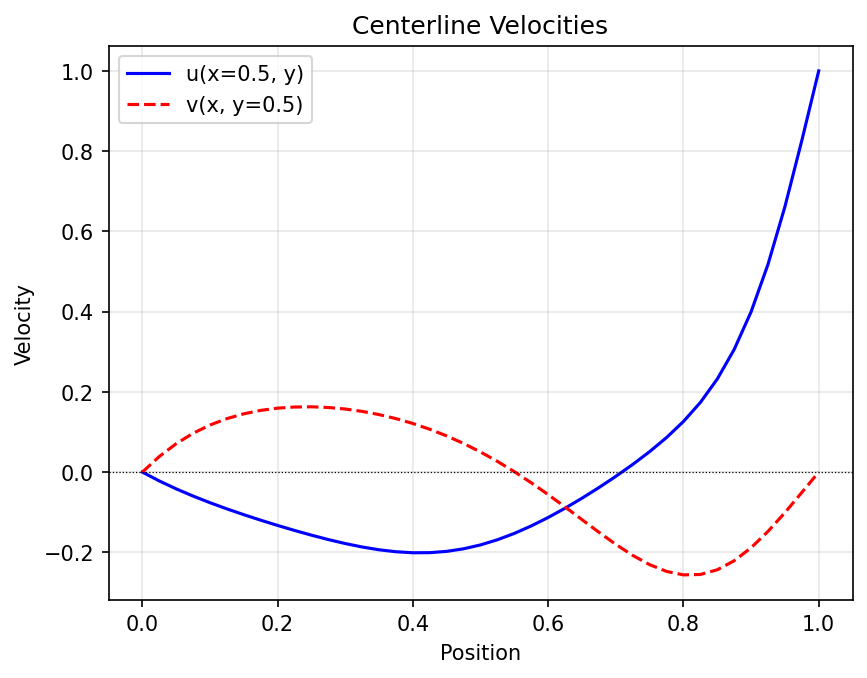
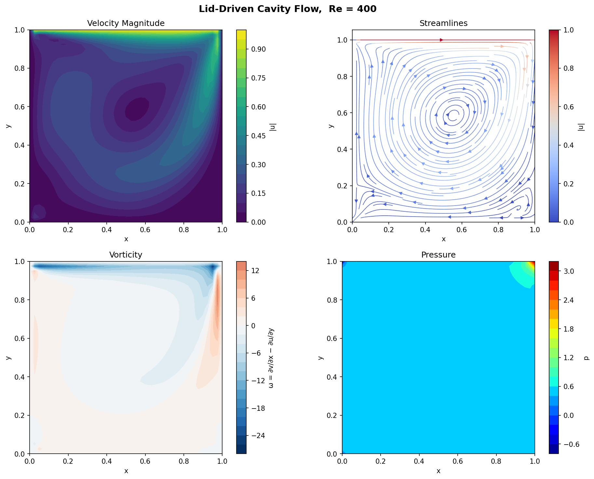
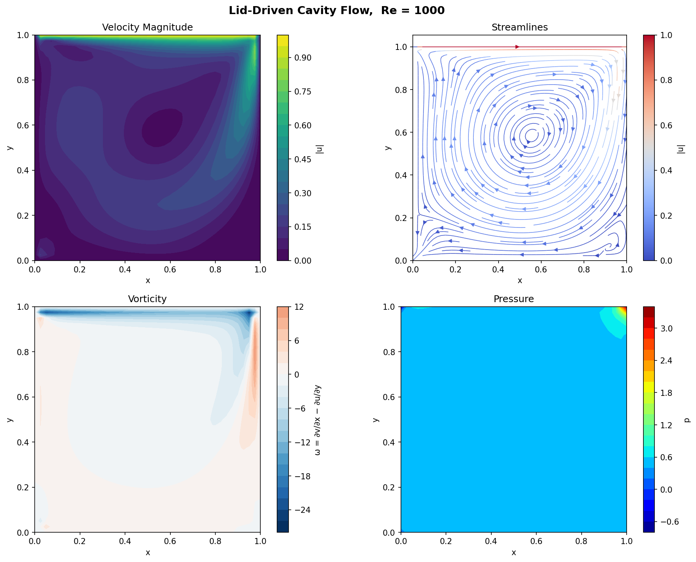
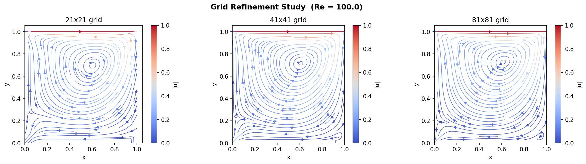

# 2D Incompressible Navier–Stokes Solver!

A Python project that simulates 2D fluid flow using the projection method. It models classic lid-driven cavity flow and lets you explore how flow behavior changes with different parameters.

## What It Does

- Solves the incompressible Navier–Stokes equations
- Uses a projection method to maintain conservation of mass
- Simulates lid-driven cavity flow
- Studies how flow changes with Reynolds number
- Automatically handles grid and time-stepping
- Creates visualizations of velocity, pressure, and streamlines

## How It Works

The solver uses three steps per time iteration:

1. **Predictor**: Calculate intermediate velocity without pressure
2. **Pressure Solve**: Solve for pressure using a Poisson equation
3. **Corrector**: Adjust velocity to be divergence-free (mass-conserving)

## Setup

```bash
pip install -r requirements.txt
```

## Run Examples

Basic simulation:
```bash
python lid_driven_cavity.py --Re 100 --Nx 41 --Ny 41 --T 15 --outdir results
```

Study Reynolds number effects:
```bash
python lid_driven_cavity.py --study --Nx 41 --Ny 41 --T 20 --outdir results
```

Study grid resolution:
```bash
python lid_driven_cavity.py --refine --Re 100 --T 15 --outdir results
```

## Test

```bash
pytest test_solver.py -v
```

## Files

- `navier_stokes_2d.py` — Core solver
- `lid_driven_cavity.py` — Main simulation script
- `visualization.py` — Plotting tools
- `test_solver.py` — Tests
- `requirements.txt` — Dependencies

## Physical Setup

- Square domain with a moving top wall (drives the flow)
- Three stationary walls with no-slip condition
- Fluid starts at rest


## Expected Results

- **Low Re (≤100)**: Single stable vortex
- **High Re (400+)**: Multiple vortices form in corners

## Example Results (Images)

Below are sample outputs generated by the code for a lid-driven cavity at $Re=100$:

### Velocity Field and Streamlines


At low Reynolds number, the flow forms a single stable vortex in the center of the cavity, with smooth streamlines and no secondary vortices in the corners.


### Centreline Velocity Profiles


This plot shows the velocity profiles along the vertical and horizontal centerlines of the cavity. It helps visualize how the lid-driven motion affects the flow distribution and is useful for comparing with benchmark solutions.

### Higher Reynolds Number Flows

#### Velocity Field at Re=400


At $Re=400$, secondary vortices begin to appear in the corners, and the main vortex becomes more concentrated due to increased inertial effects.

#### Velocity Field at Re=1000


At $Re=1000$, the flow exhibits even stronger secondary vortices in the corners and sharper gradients near the walls, illustrating the transition to more complex flow structures.

### Grid Refinement Study


This diagram compares the flow field at different grid resolutions for $Re=100$. Finer grids capture more detailed flow features and provide more accurate results, especially near the boundaries and in the vortex core.


## References

- H. K. Versteeg and W. Malalasekera, An Introduction to Computational Fluid Dynamics: The Finite Volume Method, Pearson Education

- A. J. Chorin, "Numerical solution of the Navier–Stokes equations", Mathematics of Computation, 1968

- R. Temam, Navier–Stokes Equations: Theory and Numerical Analysis, AMS
